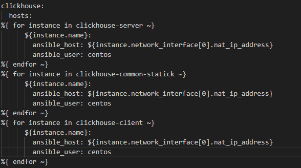
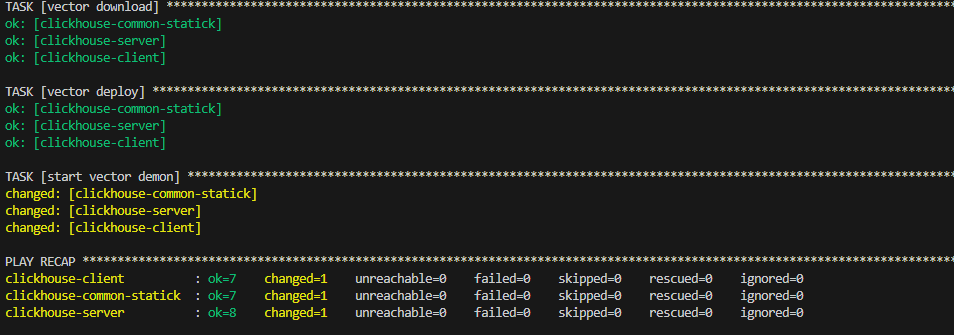

### Выполнение домашнего задания.
# 1. Заполняем файл prod.yml. 
Т.К. я использую вм от yandex cloude, то для создания файла я использовал terraform, в котором указал характеристики машин, а после создания маашин их параметры записываются в шаблон файл:
- Сбор данных о машинах:

- Шаблон генерируемого файла

- Итоговый вывод

# 2 Play на установку и настройку vector
Для начала напишем таску, где скачаем дистрибутив vector:

Следующая таска установит vector на сервер:
напишем таску

Далее сделаем таску, которая загрузит наш конфигурационный файл на сервер:
- Шаблон файла

- Таска на загрузку файла из шаблона

Таска выполняется с повышенными привелегиями и вызывает handker Start vector service.

В handlers я описал процесс перезапуска службы в случае изменения файла

Примечание: при запуске playbook на task [Create database] мы получаем ошибку:

Она связана с тем, что база данных не успела полноценнно запуститься, по этому прописываю дополнительный task.

# 3 `ansible-lint site.yml`

При выполнении данной команды возникает предупреждение

Это предупреждение указывает на то, что Ansible обнаружил файл с расширением ".yaml", который обычно используется для плейбуков Ansible, но затем переопределил его как файл плейбука.

В целом, при выплнении моего проекта ошибок не возникает, идём далее

# 4 Запуск окружения с флагом `--check`

видим, что playbook отработал верно

# 5 запуск play с флагом `--diff`

Повторим команду

