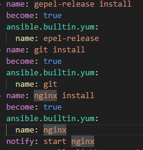

# Домашнее задание к занятию 3 «Использование Ansible»
Цель: Скачать статику LightHouse и установить Nginx для работы с сервисом clickhouse
____
#### Используемые модули ansible:
* ansible.builtin.service - управление службами на сервере
* ansible.builtin.get_url - скачивание файлов на сервер
* ansible.builtin.yum - установка ПО на сервер
* ansible.builtin.command - выполнение команд на сервере
* ansible.builtin.git - управление репозиториями
___
#### Порядок выполнения действий

1) установить clickhouse и создать БД
2) установить nginx и запустиь службу
3) установить git и распаковать предлагаемый репозимторий в каталог nginx
___
####  Inventory 
Файл inventory собирается с помощью terraform при создании ВМ в yandex cloud с применением шаблона.
___
#### Обзор кода

Основу для развертывания я взял из дз к занятию 2 «Работа с Playbook», где добавил tasks для установки и развертывания nginx и git.

Используя модуль ansible.builtin.yum я обновляю список для релизов, откуда скачается nginx, а также устанавливаю git:

После установки nginx используется handler для запуска службы nginx, тут используется модуль ansible.builtin.service

Остаётся очистить папку html и развернуть в неё вебсайт из указанного в дз репозитория. Используя 
ansible.builtin.command мы очистим папку, а при помощи ansible.builtin.git распакуем туда репозиторий

___
#### Итог

В конечном итоге код выполняется без ошибок
